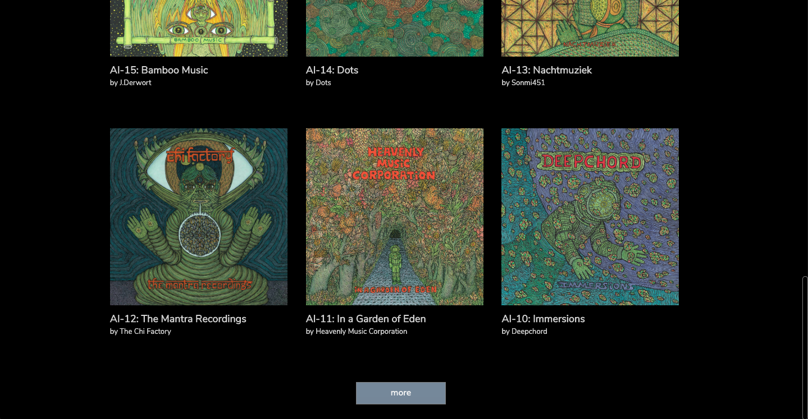

# Overview

Vue.js app where users can upload images to a gallery and add comments.

# Preview

# Features

-   Users can upload image with title, description and username

-   Users can add comments on images

-   'More' button to see more images

-   "Previous" and "Next" buttons on the image modal to see previous/next images

# Technologies

Vue.js, CSS, HTML, Node.js, Express, PostgreSQL, AWS S3

# Credits

Illustrations by Theo Ellsworth dedicated to 'Astral Industries' label.

---

Project developed during SPICED Academy, 2019.
